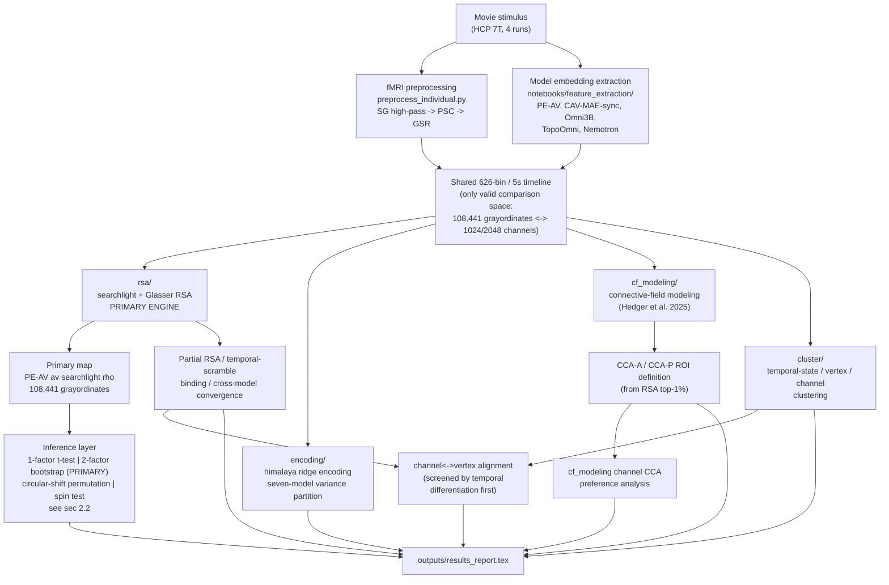

# Project Overview — Audiovisual Representation in Movie-Watching Cortex

Scientific status of this repository: what is claimed, what supports each claim, how the
modules feed each other, and what changed in the most recent work session. `README.md`
covers structure and how to run each pipeline; this document does not repeat that — it
covers the science and where each number in it lives on disk. Module-level detail lives in
`rsa/README.md`, `cluster/README.md`, `cluster/RESULTS.md`, `cf_modeling/README.md`,
`encoding/README.md`, `subcortical/README.md`, and `outputs/results_report.tex`
(the full write-up).

## 1. What this project claims

HCP 7T movie-watching fMRI (175 subjects, 4 runs, cortex + subcortex) is compared against
audiovisual transformer embeddings (PE-AV, CAV-MAE-sync, Omni3B, TopoOmni,
Omni-Embed-Nemotron-3B) on a shared 626-bin, 5-second-resolution movie timeline. Four
analysis families ask overlapping questions from that shared timeline: **RSA** (does the
brain's representational geometry match the model's?), **encoding** (can vertex activity be
predicted from the model?), **CF modeling** (do somatosensory and auditory/visual cortical
fields spatially converge, per Hedger et al. 2025?), and **clustering** (do temporal states
in the model and in the brain organize into comparable structure?). RSA is the primary
engine; encoding and CF modeling are supporting analyses run for triangulation, not as
independent headline results.

## 2. Core claims and evidence status

### 2.1 The primary result

Group-average searchlight RSA of PE-AV joint (`av`) embeddings against 108,441 cortical
grayordinates, k=100 neighborhoods, 5 s bins, 5 s skip, 5 s hemodynamic delay, Spearman,
175 subjects.
Source: `outputs/rsa/raw/group_average/pe-av-small-16-frame_av/k100_delay5s_bin5s_skip5s_spearman/rsa_59k_raw_k100_delay5s_bin5s_skip5s_spearman_searchlight.npy`.

Verified directly from that array: peak ρ = 0.1830, mean ρ (>0) = 0.0424, 99.98% of
grayordinates positive.

### 2.2 The inference story — read this before citing any percentage from this project

**Four procedures were run against the same primary map and give four different answers.
They are not interchangeable, and the disagreement is now understood rather than
unresolved.**

| Procedure | Script | What it models | Result on the primary map |
|---|---|---|---|
| 1-factor t-test | `rsa/group_stats.py` (no `--n-blocks`) | Between-subject variance only, movie content held fixed | 108,389/108,441 (100.0%) FDR-sig, max t=43.67 |
| **2-factor block bootstrap (primary)** | `rsa/group_stats.py --n-blocks 16` → `rsa/shared/rsa_utils.py::corrected_2factor_bootstrap` | Between-subject **and** between-stimulus-block variance (Schütt et al. 2023 Eq. 5) | n_blocks=16: **6,963/108,441 (6.4%)**; n_blocks=8: 0/108,441; n_blocks=4: 0/108,441 |
| Circular-shift permutation | `rsa/perm_searchlight.py` | None modeled; null from run-aware temporal shifts of the model timeseries | 764/108,441 (0.70%) FDR-sig |
| Spin test | `rsa/run_spin_permutations.py` | Spatial autocorrelation only, single map vs. spatially-rotated copy of itself | 187/108,441 (0.17%) uncorrected, **0/108,441 after FDR** |

All four numbers reloaded and matched exactly against their source arrays/JSON
(`outputs/statistical_reconciliation.md`; the perm_searchlight FDR mask count was
independently re-verified here by summing
`outputs/rsa/raw/group_average/pe-av-small-16-frame_av/k100_delay5s_bin5s_skip5s_spearman/rsa_59k_raw_k100_delay5s_bin5s_skip5s_spearman_fdr_mask.dscalar.nii` = 764).

**Why the 16-block bootstrap is primary, not the 1-factor test.** The 1-factor test treats
the movie stimulus as a fixed condition set identical for every subject; with N=175
subjects, essentially any small, population-consistent bias — including one caused by a
handful of well-tracked movie segments that have nothing to do with genuine audiovisual
binding — reaches significance almost everywhere. The 2-factor bootstrap additionally
resamples movie blocks, asking whether the effect would survive under a different sample of
naturalistic content — the claim actually being made whenever this project says "where
integration lives." That is why 100.0% collapses to 6.4%: most of the cortex that looked
significant was significant only relative to between-subject noise, not between-stimulus
noise.

**The spin test trap.** `rsa/run_spin_permutations.py`'s CLI takes exactly one map — there
is no second/reference map anywhere in the script. Its null is
`null[s, v] = empirical[spin_indices[s, v]]`: each vertex's value under a spatial rotation
of the *same* map. This is a single-map, self-referential, local-hot-spot test — "does this
vertex stand out from a spatially shuffled copy of the same map" — not a test of the map
against zero, and not a two-map spatial-correspondence test in the classical
Alexander-Bloch (2018) sense. Because the primary map is diffusely, near-uniformly positive
(no sharp punctate peaks), a hot-spot-vs-shuffled-self test finds almost nothing **by
construction**, independent of whether the map's overall level is real. **The near-zero
spin-test result must never be cited as evidence against the effect or as a failed
spatial-autocorrelation control.** This has been misread twice already; see
`outputs/statistical_reconciliation.md` §2 for the full argument.

**Synthesis.** Procedures that model stimulus variance (2-factor bootstrap) or temporal
autocorrelation (circular-shift permutation) agree the effect is real but **spatially
concentrated**, not cortex-wide. Restricting the primary map to the 6,963 grayordinates
(6.4% of cortex) that survive the 2-factor bootstrap FDR gate at n_blocks=16 *sharpens* the
result rather than weakening it: mean ρ rises from 0.0424 (unmasked) to 0.0888 (masked,
2.1×), and the surviving territory concentrates in bilateral **TA2, A4, A5, TPOJ1, STGa**
(auditory-belt/parabelt and temporo-parietal association cortex) — anatomically consistent
with the independent five-model cross-architecture convergence analysis in
`outputs/results_report.tex` (auditory-association/parabelt: TA2, MBelt, PI, TPOJ1,
PBelt, STGa, area 52). That cross-check — restricting to the statistically defensible 6.4%
of cortex lands in the same territory implicated by a completely different method — is
stronger evidence than the raw "99.98% of vertices positive" descriptive number.

*One separate, unrelated t-test also produces a t≈34.7/99.97%-cortex figure that is easy to
confuse with the primary map's own 1-factor test (t=43.67/100.0%, above): it is the
per-subject paired intact-vs-scrambled random-effects test described in §2.4, not a second
inference procedure on the primary map itself.*

### 2.3 The 16-block power ceiling

Every 2-factor-corrected claim's effective N is **16 movie blocks**, not 175 subjects: df =
`min(n_subjects-1, n_blocks-1)` = 15. At the primary map's peak vertex, block-to-block
variance dominates subject-to-subject variance by roughly two orders of magnitude — this is
exactly the regime `tests/test_paired_bootstrap_resampling.py`'s synthetic self-check is
tuned to (`sigma_common=0.045` vs. `sigma_noise=0.02`, docstring: "matching the real PE-AV
data, where per-vertex block-to-block variance is ~2 orders of magnitude larger than
subject-to-subject variance"). Recruiting more subjects cannot raise power under this
regime. The two remedies are (a) restrict the comparison family to an *anatomically*
defined a priori ROI — never one derived from the map under test, which would be circular —
or (b) increase block count via finer temporal blocking. Neither has been run yet (§5).

### 2.4 Temporal-scramble binding: underpowered, not falsified

Two complementary consolidations of intact-vs-scrambled AV pairing exist, in different
currencies, both over the same 18 model/readout combinations (PE-AV, CAV-MAE-sync, Omni3B,
TopoOmni ×3 depths ×{mean-pool, last-token}, Nemotron ×4 layers):

- **Plain (non-partialled) RSA diff** (`rsa/scramble_diff_maps.py`): all **18/18**
  configurations show a positive mean diff — scrambling reduces raw RSA everywhere, not
  only its integration-contrast residual.
- **Partial-RSA integration-contrast binding map** (`rsa/temporal_scramble_binding.py`):
  **17/18** positive; CAV-MAE-sync is the one exception (mean −0.0024, 28.7% positive),
  plausibly because its own integration signal was already the weakest of the five
  architectures.

The direct per-subject test of this claim
(`rsa/scramble_paired_stats.py`, PE-AV av, N=175, paired diff = ρ_intact − ρ_scrambled per
subject per grayordinate) gives a **1-factor** paired t-test of 108,413/108,441 (99.97%)
FDR-significant, peak t=34.7 — this is the t≈34.7/99.97% figure, and it belongs to this
scramble test, not to the primary map's own 1-factor test (§2.2). Under the same **2-factor**
block-bootstrap correction used for the primary map (n_blocks=16), this paired diff drops
to **0/108,441 FDR-significant** (verified: `n_sig_c2f: 0` in
`scramble_paired_stats_175subs_nblocks16_summary.json`; the corresponding
BH-corrected p-value map's minimum, computed here directly from the stored
`sigmap_c2f`/`t_c2f` maps, is **p_fdr ≈ 0.085**, and the minimum one-sided uncorrected p at
that same df=15 is ≈0.0005 — the report's own framing of "near-miss," not the specific
"≈0.0028" uncorrected figure sometimes quoted for this result; see the discrepancy note at
the end of this document).

This is read as **underpowered, not falsified**: it is the same 16-block ceiling as §2.3,
now applied to a paired-difference statistic that is even more sensitive to shared
temporal autocorrelation between the two RSA time series being subtracted. The descriptive
18/18-positive result, the partial-RSA binding control, and the per-subject random-effects
t-test all converge; only this one specific block-resampling correction does not, and it is
plausibly over-conservative for a paired design rather than evidence of no effect
(`outputs/results_report.tex`, "Conservative-correction caveat," line ~801).

A suspected bug in the paired block bootstrap was investigated and **there is none**:
production code computes `diff_block = intact_block - scrambled_block` *before* calling
`corrected_2factor_bootstrap`, so resampling draws one joint subject/block sample that
applies to both conditions at once — the shared subject+block noise cancels by
construction. `tests/test_paired_bootstrap_resampling.py` demonstrates on synthetic data
that this joint scheme has near-nominal false-positive rate and usable power, while the
alternative (bootstrapping each condition independently, then summing variances) silently
and severely loses power by double-counting noise that should cancel.

### 2.5 Partial RSA — regressing out unimodal nuisance models

`rsa/partial_rsa.py` regresses nuisance model RDMs out of the PE-AV `av` target RDM before
brain comparison, configured via `rsa/shared/model_registry.py`. Three variants exist for
the primary map, all verified against
`outputs/rsa/raw/group_average/pe-av-small-16-frame_av_partial_corr*/k100_delay5s_bin5s_skip5s_spearman/partial_corr_r_searchlight.dscalar.nii`:

| Nuisance regressed out | Mean ρ | Peak ρ |
|---|---|---|
| AudioMAE only | 0.0413 | 0.1765 |
| VideoMAEv2-Large only | 0.0354 | 0.1766 |
| Both (AudioMAE + VideoMAEv2-Large) | 0.0344 | 0.1684 |

Partialling reduces peak ρ modestly (≈8%) and still leaves the map positive at nearly every
vertex — indicating PE-AV `av` encodes multimodal information not fully explained by either
unimodal model alone. Whether that residual is genuinely whole-cortex or concentrated in
the 6.4% bootstrap-significant core (§2.2) is not separately tested by partial RSA itself.

### 2.6 Channel-level modality vs. CCA preference — retracted and replaced

**Superseded 2026-09-02.** The earlier result in this section — an audio-only-minus-video-only
channel contrast of +0.077, 95% CI [0.029, 0.119], q=0.0024, with 155/166 subjects positive —
depended on thresholding two continuous quantities into a 4-class channel scheme
(`audio_only`/`video_only`/`both`/`neither`). That scheme has been deleted. The contrast does not
survive without it and should not be cited.

**What replaces it.** Two continuous per-channel axes, both signed, computed on run-wise z-scored
626-bin timeseries:

- modality axis = corr(intact AV, audio-only pass) − corr(intact AV, video-only pass)
- CCA axis = corr(intact AV, CCA-A ROI mean) − corr(intact AV, CCA-P ROI mean)

plus a partial variant of each (audio given video minus video given audio; anterior given
posterior minus posterior given anterior). Positive = audio-preferring and anterior-preferring.
Correlating the two axes across channels, with a moving-block bootstrap CI (block length 5 bins
≈ 25 s, 2000 resamples):

| Model | Variant | Spearman | Pearson |
|---|---|---|---|
| PE-AV (1024 ch) | zero-order | −0.037 [−0.064, +0.009] | −0.035 [−0.064, +0.008] |
| PE-AV | partial | −0.029 [−0.058, +0.014] | −0.024 [−0.056, +0.016] |
| Nemotron L18 mp (2048 ch) | zero-order | −0.025 [−0.045, −0.000] | −0.023 [−0.041, +0.000] |
| Nemotron L18 mp | partial | −0.025 [−0.043, −0.003] | −0.035 [−0.054, −0.008] |
| Topo-Omni L18 sheet mp (2048 ch) | zero-order | −0.000 [−0.049, +0.051] | +0.002 [−0.049, +0.049] |
| Topo-Omni L18 sheet mp | partial | +0.009 [−0.039, +0.056] | +0.012 [−0.036, +0.055] |

**Interpretation.** All six correlations are within ±0.04 of zero and five of six CIs include
zero; the one exclusion (Nemotron, partial) is small and not replicated in the other two
architectures. A channel's modality preference carries essentially no information about whether
it tracks anterior or posterior CCA territory. This is a null, and it is consistent across three
independent model families — the previous positive contrast was an artifact of the discarded
thresholding, not a weaker version of the same effect.

`cf_modeling/persubject_cca_channel_1pct.py` has been rewritten against these two axes (fixed
group-level modality axis; per-subject CCA axis from each subject's own top-1% mask) but has
**not been re-run**; the per-subject numbers previously quoted here are withdrawn, and
`outputs/cf_modeling/persubject_cca_1pct/README.md` still describes the retired class scheme.

Artifacts (table above verified directly against these JSONs, values unchanged):
`outputs/cf_modeling/channel_cca_preference/results/` —
`channel_modality_cca_correlation_peav_top1pct_peav.json`,
`channel_modality_cca_correlation_nemotron_layer18_mp_top1pct_nemotron_layer_18_mp.json`,
`channel_modality_cca_correlation_topoomni_layer18_sheet_mp_top1pct_topoomni_layer_18_mp.json`,
and six scatter PNGs (zero-order + partial per family):
`peav_zero_order_scatter.png`, `peav_partial_scatter.png`,
`nemotron_layer18_mp_zero_order_scatter.png`, `nemotron_layer18_mp_partial_scatter.png`,
`topoomni_layer18_sheet_mp_zero_order_scatter.png`,
`topoomni_layer18_sheet_mp_partial_scatter.png`. Scripts: `cf_modeling/channel_cca_analysis.py`,
runner `cf_modeling/run_channel_cca_analysis.sh`. Bootstrap settings recorded in the JSONs:
2000 resamples, block length 5 bins, seed 20260826, run_bins [151, 161, 156, 158], 626 total
bins.

### 2.7 Clustering: the k=2 bias, and how it was screened out

The clustering pipeline (`cluster/vertex_model_selection.py`, shared by
`cluster/channel_timeseries_model_selection.py`) picks a winning configuration per
selection role via an internal selection criterion (never reported here — see below).
That criterion rewards few, well-separated clusters, so it is structurally biased
toward k=2. On the **vertex side**, k=2 wins every
selection role (silhouette 0.885, 0.865, 0.715 for display_2d/display_3d/latent_best —
all confirmed on disk), and its two cluster-mean time series correlate at r≈0.97 —
near-total temporal redundancy, i.e. one shared stimulus-locked global signal split in
two, not two functionally distinct networks. On the **channel side**, the bias appears
for nemotron and topoomni but not for peav (peav's `latent_best` winner is k=16). Full
tables: `cluster/RESULTS.md` §1.

**The fix applied:** `cluster/screen_temporal_differentiation.py` computes, for every
candidate clustering, the mean |off-diagonal Pearson r| among that solution's own
cluster-mean profiles on the 626-bin timeline — low = temporally distinct clusters, high =
one signal split into near-duplicates. Vertex-side k=2 solutions score 0.938–0.974
(confirms redundancy); the vertex side never gets past *partial* differentiation even at
its best (plateaus at 0.406–0.55, no k tested reaches full separation). Channel-side peav
and nemotron reach 0.10–0.18 at k=12–44 (well-differentiated); **topoomni never drops below
≈0.27 at any k from 2 to 100** — no swept topoomni channel configuration is usable as a
differentiated clustering (`outputs/cluster/_channel_vertex_alignment_screen.csv`, 216
rows). **The top row of the pipeline's internal composite must never be taken as "the"
clustering for a downstream analysis without this screen.**

Visualized in `cluster/vertex_cluster_scatterplots.ipynb` (vertex side) and
`cluster/channel_cluster_scatterplots.ipynb` (channel side, same six
reducers/three clusterers, run per family).

### 2.8 Channel-vertex functional alignment

`cluster/channel_vertex_alignment.py` correlates each vertex cluster's mean profile
against each channel cluster's mean profile on the shared 626-bin timeline (the only
comparable quantity between disjoint index sets — 108,441 grayordinates vs. 1,024/2,048
embedding channels), tested against a circular-shift null (5,000 shifts) and again after
regressing the cortex-wide mean bin timeseries out of both sides ("global-signal control").
Pooled across the four temporally well-differentiated configurations (peav and nemotron, at
their k6×6 and k24×16 pairings; 201 significant pairs after global-signal control): |r|
range 0.106–0.369, mean 0.178 (`cluster/RESULTS.md` §3).

The internal control that makes this credible: the *poorly*-differentiated peav k6×6
config collapses from 15→3 significant pairs under global-signal control, while the
*well*-differentiated k24×16 configs are essentially unchanged (peav 67→65, nemotron
115→116). topoomni's raw counts are the highest of any family (34, 211) but are explicitly
**not** treated as evidence — per §2.7, no topoomni channel clustering differentiates at any
swept k, so its "significant pairs" are plausibly the same redundant signal counted
repeatedly.

### 2.9 Cross-model independence convention

Omni3B, TopoOmni, and Omni-Embed-Nemotron-3B all descend from Qwen2.5-Omni-3B and count as
one family for validation purposes — one member of this family must never drive another
member's clustering, localizer, or ROI definition. PE-AV is the architecturally independent
model used whenever an analysis needs a model that cannot validate itself (e.g. clustering
stimuli to test a TopoOmni readout).

### 2.10 A deliberate non-decision

A full repository restructure was considered and explicitly rejected: the audit found no
dead code and no over-abstraction, and the "legacy" `cluster/run_cluster.py` interaction
pipeline (HMM stimulus-state × HDBSCAN brain-network) is a complete, frozen scientific
result that shares `cluster/io_cluster.py` with the current clustering-selection pipeline —
not a candidate for deletion (`cluster/README.md`). Recorded here so it is not relitigated.

Two minor, unresolved naming issues, confirmed on disk, left as-is pending a decision:

- `rsa/channel_class_rsa.py` writes its output CIFTI into
  `outputs/cf_modeling/channel_cca_preference/results/rsa/`, not under `outputs/rsa/`.
One genuinely orphaned file: root-level `verify_subjects.py` (a standalone subject-list
sanity check, not wired into any `analysis.sh` or module).

### 2.11 Full-sheet RSA — the whole Topo-Omni sheet, not one layer

Every previous Topo-Omni result in this project used `topoomni_layer18_sheet_mp` — one
thinker-stack layer, 4 of 304 rows of the sheet. This analysis covers all 304×512 = 155,648
units, and is now a single consolidated script (`rsa/full_sheet_rsa.py`) rather than three
overlapping ones: it replaces a layer-18-only raster-lattice driver (2,048 units = 1.3% of the
sheet, plotted at the fallback lattice the checkpoint was not trained under) and a
hand-picked-6-layer true-coordinate driver; both retired scripts are gone from `rsa/`. Shared
geometry/plotting/`characterize()` now live in `rsa/shared/sheet_rsa.py`.

**Sheet geometry.** The model loaded is `Qwen2_5OmniThinkerForConditionalGeneration` — the
Thinker only; the Talker (speech generation) is never instantiated, so **the whole sheet is
the Thinker**. Three sub-modules inside it each carry their own `CorticalAdaptor` list:
vision encoder (`vision_config.depth=32`) at rows 0–159/cols 0–255 (40,960 units), audio
encoder (`audio_config.encoder_layers=32`) at rows 0–159/cols 256–511 (40,960 units), and the
Thinker text model (`text_config.num_hidden_layers=36`) at rows 160–303/all 512 cols (73,728
units, 47.4% of the sheet — larger than both perceptual towers combined). This third tower is
called **thinker** throughout, never "decoder": the extraction script's variable naming and
upstream `Model Repos/topo-omni/src/models/qwen2_5_omni.py`'s `multimodal_cortical_sheet`
(line 197; adaptor list at line 597) both refer to the same object — the autoregressive
language backbone consuming fused audio+video tokens, **not** a Whisper-style audio decoder
and **not** the Talker. The old layer-18 reference is rows 232–235 of this tower — 4 of 304
rows.

**Scripts:** `notebooks/feature_extraction/topo_omni_extract_full_sheet.py` (extraction,
intact joint-AV pass only), `rsa/full_sheet_rsa.py` + `rsa/run_full_sheet_rsa.sh` (searchlight
RSA, plus the topography control below, folded into the same script). Full parameter and
artifact listing: `rsa/README.md`, "Full-sheet RSA".

**Validation that this sheet is the same object as the earlier layer-18 embeddings:** the
extraction script's gate correlates all 36 thinker-stack layers against the pre-existing
`topoomni_layer18_sheet_mp_av.npy` and asserts layer 18 is the unique argmax. Passed: layer 18
= 0.7089, runner-up layer 19 = 0.3041, margin 0.4049.

**The result.** 155,648 units × 626 bins, k=100, n_perm=1000, spearman, seed 42, 5 s bins / 5 s
skip / 5 s delay, true coordinates (`permute_coordinates`, seed 42 — a seeded permutation of
the raster lattice within each architectural block, not a rotation). cca_a (anterior seed) rho
range [0.00535, 0.46769], mean 0.1157, 154,044/155,648 (98.97%) FDR-significant. cca_p
(posterior) range [0.00875, 0.23909], mean 0.0953, 155,648/155,648 (100%) FDR-significant —
both at ceiling; this is a manipulation check (every sheet unit's k-NN patch tracks the movie
at all), not a localization finding. Per-tower mean rho — vision: cca_a 0.0395 / cca_p 0.0506;
audio: 0.2732 / 0.1439; thinker: 0.0706 / 0.0931.

**The finding.** The anterior>posterior contrast is entirely an audio-tower effect: in the
vision tower and the thinker stack, posterior edges anterior instead (per-tower diff_mean
−0.0111 vision, −0.0225 thinker, vs. +0.1293 audio). diff (a minus p) mean +0.0205, sd 0.0710,
positive in only 31.16% of units — the audio tower is 26.3% of the sheet, which is what
reconciles a positive mean with a minority of positive units. Hotspots (top decile by rho) are
almost entirely audio: cca_a 15,480/15,565 (99.5%), cca_p 15,255/15,565 (98.0%).

**Topography control — does not test what it looks like it tests.** True k=100 spatial
neighbourhood vs. k=100 random units drawn uniformly from the same tower (coordinates
ignored), 3 draws, folded into `rsa/full_sheet_rsa.py` rather than a separate follow-up
script. Across all 8 combinations checked (2 seeds × {overall, vision, audio, thinker}), the
true neighbourhood scored *lower* than the random same-tower sample — `true_beats_random=false`
throughout, e.g. cca_a overall true mean 0.1157 vs. random mean 0.1697; cca_a audio tower true
0.2732 vs. random 0.3966. That result does **not** mean the true coordinates carry no
topography: the regenerated sheet maps show obvious, strong spatial structure (smooth,
labyrinthine, not scattered) across all three towers, and spatial smoothness is exactly what
predicts a compact k=100 patch scoring lower than a scattered same-size draw — adjacent units
in a smooth map are mutually redundant, so the patch spans fewer independent dimensions than
an equally sized scattered sample. The control is uninformative about whether the topography
is meaningful, in either direction — it neither confirms nor refutes it. A control that would
bear on that question would compare against a sheet with the spatial-smoothness loss ablated,
or against a spatially shuffled sheet that preserves the marginal rho distribution — neither
has been run. The per-tower magnitude comparisons above do not depend on this control and are
unaffected by it.

**Per-unit inference on the difference (added).** The per-seed FDR tests above are each
against zero; they say nothing about rho(cca_a) vs. rho(cca_p) directly. A paired two-sided
permutation test now does: `perm_idx_all` is generated once in `full_sheet_rsa.py`'s `main()`
and reused for both seeds, so permutation j is the identical within-run circular shift for
both, making `null_diff_j(unit) = null_rho_a_j(unit) - null_rho_p_j(unit)` a genuine paired
null (verified against an independently-shuffled/unpaired null in
`tests/test_perm_searchlight.py`, which gives a different exceedance count on the same data).
p(unit) = (1 + #{j : |null_diff_j| >= |observed_diff|}) / (1 + n_perm), BH-FDR across all
155,648 units. See `metadata.json`'s `diff_inference` key for the exact fraction
FDR-significant and its by-tower breakdown, and `rsa/README.md`'s "Full-sheet RSA" section for
the same numbers narrated.

**Caveats — limits, not findings:**

- Cross-seed spatial Pearson r = 0.8639, top-decile hotspot Jaccard 0.7940 — both high, so the
  two seed maps largely coincide overall. That is not the whole picture: the difference map has
  real structure concentrated in the audio tower (per-tower mean rho, cca_a/cca_p: vision
  0.0395/0.0506, audio 0.2732/0.1439, thinker 0.0706/0.0931), so the A-P contrast is not spread
  uniformly across a residual on an otherwise identical map — it is a specific, audio-tower
  effect. Both facts hold at once.
- The hotspot contiguity test is saturated and must not be cited as evidence:
  `observed_mean_nn_dist` 1.00232 (cca_a) / 1.00343 (cca_p) against an integer-grid floor of
  exactly 1.0, versus a null of ~1.7059, p = 0.0005 — exactly 1/2001, the smallest value 2000
  permutations can produce. It also tests spatial clustering on coordinates generated by a
  topographic training objective, so clustering is true by construction. This is a second
  instance of the same failure mode already recorded for the spin test (§2.2) — a test that is
  null-by-construction on the map it is applied to.
- No unimodal a/v passes were extracted for the full sheet, so no per-unit stimulus-modality-
  preference analysis (unlike the retired layer-18/truecoords scripts) is possible here.

**Artifacts:** `outputs/rsa/cca_seed_sheet_rsa/fullsheet_k100_truecoords/` — two `_rho.npy`,
three `.csv` (`cca_a_av.csv`, `cca_p_av.csv`, `diff.csv`), the paired-difference `diff_p_perm.npy`
and `diff_p_fdr.npy`, five PNG sheet maps (`cca_a_av_rho_sheet_map.png`,
`cca_p_av_rho_sheet_map.png` sharing one colour scale, `diff_rho_sheet_map.png`,
`diff_p_sheet_map.png`, `diff_fdr_sig_sheet_map.png`), `metadata.json`. See `rsa/README.md` for
the full parameter and file listing.

## 3. Analysis graph

The shared 626-bin, 5-second-resolution movie timeline is the **only valid comparison
space** between the fMRI grayordinate axis (108,441 cortical + subcortical units) and each
model's channel axis (1,024 for PE-AV, 2,048 for the Omni-family models) — these index sets
are otherwise disjoint and never compared directly.

## 4. Recent-session inventory

Everything below is new or untracked on disk (`git status`), read directly (docstring +
CLI/argparse) rather than inferred from filenames. Grouped by module; each line names the
output location where the script writes.

### `cf_modeling/`

- `LBOE_200_validation.md` — sensitivity check: 50/100/200 requested LBOEs give full-map
  held-out R² correlating ≥0.996 with the 200-LBOE fit; concludes no evidence of overfitting
  at 200 LBOEs, documents the `min(requested, n_L-2, n_R-2)` per-hemisphere cap.
- `bivariate_cifti.py` — shared pycortex-style 2-D bivariate colormap quantizer and CIFTI
  dlabel/legend writer; imported by every `export_*_bivariate_cifti.py` script below, not
  run standalone.
- `cf_naming.py` — small naming helper: parses/appends/strips the `_lboeN` suffix on
  analysis-ROI names without touching the underlying mask name.
- `channel_cca_analysis.py` — relates AV-sensitive embedding channels (audio/video winner
  and 4-class significance, block-bootstrap tests) to CCA-A/CCA-P ROI-mean timecourses for
  PE-AV, Nemotron-18-MP, and TopoOmni-18-sheet-MP; writes into
  `outputs/cf_modeling/channel_cca_preference/results/analyses/`.
- `channel_cca_notebook.py` — table/figure-building helpers (CIs, FDR, display labels) used
  by `channel_cca_preference.ipynb`; not run standalone.
- `channel_cca_preference.ipynb` — the executable report/visualization surface for the
  channel-CCA analysis; the only place these results are plotted. Writes
  `outputs/cf_modeling/channel_cca_preference/results/{analyses,rsa,tables,figures}/`.
- `compare_lboe_sensitivity.py` — summarizes held-out PE-AV CCA fits across requested LBOE
  counts into a JSON + markdown comparison table (feeds `LBOE_200_validation.md`).
- `export_bivariate_cifti.py` — exports one Hedger-style 2-D CF map (ROI-A × ROI-B R²_nc) as
  a quantized wb_view dlabel + legend, into the ROI pair's `cifti_maps/` directory.
- `export_partial_bivariate_cifti.py` — exports the 8-map partial-correlation CCA CIFTI as
  four 2-D dlabels (bilateral/within-hemisphere/L/R).
- `export_raw_corr_bivariate_cifti.py` — same, for the ordinary (non-partial) ROI-mean
  correlation CIFTI.
- `migrate_cca_artifacts.py` — dry-run-by-default renamer that migrates legacy `mca_v`/
  `mca_d` artifact names to the canonical `cca_a`/`cca_p` names, additive or in-place, with a
  JSON rollback manifest.
- `migrate_lboe_artifacts.py` — dry-run-by-default renamer that appends `_lboeN` qualifiers
  to historical unqualified fitted-CF-tree artifacts; writes
  `lboe_naming_migration_manifest.json`.
- `persubject_cca_channel_1pct.py` — per-subject top-1% PE-AV mask fitting and audio/video
  channel-preference contrast (§2.6 above); writes
  `outputs/cf_modeling/persubject_cca_1pct/{per_subject_contrast.csv, mask_dice_summary.json,
  group_summary.json}`.
- `roi_definitions.json` — central config for CCA-island ROI construction (thresholds,
  candidate-model ranking) consumed by `run_cca_islands.py`.
- `roi_mean_partial_connectivity.py` — computes bilateral/within-hemisphere/L/R ROI-mean
  partial-correlation maps (exact three-correlation identity, no ridge) between two CCA ROI
  timecourses and every grayordinate.
- `roi_mean_raw_connectivity.py` — same, ordinary (non-partial) Pearson correlation.
- `run_cca_islands.py` — thresholds the group-average PE-AV RSA map at 0.12 (or other
  configured cutoff/percent), selects the two largest bilateral temporal-lobe surface
  components per hemisphere, and writes reusable CCA-A/CCA-P masks + labeled dlabel.
- `run_channel_cca_analysis.sh` — driver for the channel-CCA analysis modes (`analyze`,
  `topoomni`, `nemotron-own-rois`).
- `status.md` — running lab-notebook status log for the CF-modeling/channel-CCA work
  session. Its block-bootstrap channel counts and CCA-A−CCA-P contrast (+0.077) belong to the
  retired 4-class scheme and are superseded — see §2.6. Also records that the per-subject CF
  run (`02_fit_cf_model.py --mode per_subject`, ROI pair `cca_a_peav_1pct_lboe100` ×
  `cca_p_peav_1pct_lboe100`) was deliberately halted 2026-09-03 to free the GPU, not a crash:
  26 subjects complete (8.6 GB) at `/media/amin/ADATA HD710 PRO/cf_modeling/per_subject/cca_a_peav_1pct_lboe100_cca_p_peav_1pct_lboe100/subjects/`;
  subject 140117 was killed mid-fit holding only its `.yml` config and `pipeline.log`, no
  `.npy`, so it is re-fit rather than skipped on resume. See `status.md` for the full entry
  and log path.

### `cluster/`

- `README.md` — new module documentation (the two independent pipelines, script reference,
  hyperparameter-selection workflow); see there for full usage.
- `RESULTS.md` — the write-up of the clustering-selection pipeline's two retained
  descriptive screens: selection-score bias toward $k=2$ and temporal differentiation
  of the resulting cluster means.
- `channel_timeseries_clustering.py` — channel analogue of `vertex_clustering.py`:
  reduces/clusters embedding channels (rows) across the 626 movie bins (columns); writes
  CSV labels (no grayordinate axis).
- `channel_timeseries_model_selection.py` — channel analogue of
  `vertex_model_selection.py`; same sweep/selection-score math, CSV output.
- `consolidate_vertex_outputs.py` — merges selected vertex-clustering maps
  into six review CIFTIs under `review_ciftis/`, including the stable
  `best_vertex_clusterings.dlabel.nii`; `--delete-duplicates` removes superseded per-run
  dlabels after round-trip validation.
- `run_vertex_clustering.sh` — driver for the baseline vertex-timeseries
  reduction×clustering sweep.
- `run_vertex_model_selection.sh` — driver for the hyperparameter-selection sweep.
- `screen_temporal_differentiation.py` — the k=2-bias screen (§2.7); writes
  `outputs/cluster/_channel_vertex_alignment_screen.csv` (216 rows: 54 vertex + 162 channel).
- `vertex_cluster_scatterplots.ipynb` — executed notebook with reducer and clustering
  sweep diagnostics, unclustered embeddings, selected 2-D/3-D solutions, latent-best
  projections, and the 54-map `best_vertex_clusterings.dlabel.nii` export.
- `vertex_clustering.py` — baseline grayordinate reduction (PCA/MDS/Isomap/t-SNE/
  FastICA/UMAP) × clustering (k-means/HDBSCAN/BIRCH) sweep; writes
  `outputs/cluster/group_average/_vertex/`.
- `vertex_model_selection.py` — the two-stage hyperparameter-selection pipeline
  (reducer sweep via trustworthiness/continuity/rank agreement, then clustering sweep via
  an internal selection criterion, see §2.7); writes
  `outputs/cluster/group_average/_vertex/`.

### `rsa/`

- `av_derived_maps.py` — appends nine descriptive AV comparison maps (conjunction,
  superadditivity, max-uni, each against `own`/`unimodal`/`text_aligned` reference
  families) to a group-average `_av` searchlight CIFTI.
- `channel_class_rsa.py` — **DEPRECATED** (2026-09-02). Searchlight RSA restricted to
  AV-sensitivity-classed embedding channels (audio_only/video_only/both/neither); the class
  scheme it consumes was deleted with §2.6. May be revived against the top-right / bottom-left
  quadrants of the two-axis preference scatterplots. Wrote into
  `outputs/cf_modeling/channel_cca_preference/results/rsa/` (naming note, §2.10).
- `max_uni.py` — per-subject AV-minus-max-unimodal RSA contrast with proper group inference
  (per-subject contrast computed first, then one-sample t-test + BH-FDR across subjects).
- `residualized_maps.py` — consolidates one AV model's `partial_correlation`,
  `linear_resid_unimodal`, and `projection_resid_own` scalars into a single CIFTI, resumable per scalar.
- `run_channel_class_rsa.sh` — **DEPRECATED**, hard-exits. Was the driver for the
  12-analysis (3 models × 4 significance classes) channel-class RSA run.
- `run_spin_permutations.py` — restored verbatim from git history (was renamed/deleted, only
  a stale `.pyc` survived) — see §2.2 for the critical scope caveat on what this test
  actually measures.
- `full_sheet_rsa.py`, `run_full_sheet_rsa.sh` — the full-Topo-Omni-sheet searchlight RSA
  (§2.11). Consolidates what were three overlapping scripts (a layer-18-only raster-lattice
  driver, a hand-picked-layer true-coordinate driver, and this full-sheet driver) into one
  sweep over the whole 155,648-unit sheet; the two superseded drivers are retired.
  `rsa/shared/sheet_rsa.py` now holds the shared geometry (`tower_id`, `load_true_coords`,
  `knn_on_sheet`), plotting, and `characterize()`/hotspot machinery. `characterize()`'s
  nearest-neighbour null was already an exact `cKDTree` implementation (replacing an O(n²)
  `cdist` version that did not scale past ~12,288 units) and carries over unchanged; it now
  reports per-tower (vision/audio/thinker) breakdowns instead of per-decoder-layer ones.
  The topography control (true k-NN neighbourhood vs. random same-tower sample) is folded
  into the same script rather than living in a separate follow-up file.

### `encoding/`

- `variance_partition.py` — seven banded-ridge models (every non-empty subset of A, V, J) and
  the Gallant-lab variance partition, for `fixed` and `runwise` splits and `zscore` and `center`
  feature scaling; single-band models are the plain encoding results. See `encoding/README.md`.
- `diff_maps.py`, `run_diff_study.sh` — intact-versus-dummy contrasts on the same maps.
- The earlier plain per-vertex encoding (`encoding.py`), its group statistics, derived maps,
  ROI profile analysis and their outputs were retired in 2026-09 (other normalization and
  timing; they matched none of the four variants).

### `tests/`

19 new test files, one per new module above plus targeted regression checks. The one
substantively worth knowing about independent of its module:
`test_paired_bootstrap_resampling.py` — synthetic-data proof that the paired scramble
block-bootstrap resamples the already-paired difference correctly (§2.4); run directly
(`python tests/test_paired_bootstrap_resampling.py`) or via pytest. The rest are
conventional unit tests for their same-named source script (naming/CLI/output-shape checks)
and are not separately itemized here.

### New artifacts under `outputs/`

- `outputs/statistical_reconciliation.md` — the source document for §2.2 and §2.4's
  inference numbers; independently re-verifies every headline figure quoted in
  `results_report.tex` against its underlying array/JSON and finds nothing wrong, plus
  surfaces the previously-unlisted circular-shift-permutation result.
- `outputs/_report_scripts/`, `outputs/_report_extraction/` — the extraction scripts and
  CSV/JSON outputs (masked-vs-unmasked descriptives, top parcels) that
  `statistical_reconciliation.md` and `results_report.tex` are built from.
- `outputs/cf_modeling/persubject_cca_1pct/` — §2.6's output tree.
- `outputs/cf_modeling/channel_cca_preference/` — §2.6/channel-CCA notebook's full
  `results/{analyses,rsa,tables,figures}/` tree.
- `outputs/cluster/{peav,nemotron_layer18_mp}/_channel_timeseries_model_selection/` and
  `outputs/cluster/group_average/_vertex/norm-zscore_raw/` — the selected channel and
  vertex clustering candidates used by the two retained screens.
- `outputs/cluster/_channel_vertex_alignment_screen.csv` — despite its legacy filename,
  this is now the temporal-differentiation screen output; it contains no channel--vertex
  alignment inference.
- §2.5's three partial-RSA variants are consolidated into three 5-map CIFTIs under
  `outputs/rsa/raw/group_average/pe-av-small-16-frame_av/`:
  `rsa_59k_raw_k100_delay5s_bin5s_skip5s_spearman_partial_corr_from_unimodals.dscalar.nii`
  (AudioMAE/VideoMAEv2 nuisances), `..._partial_corr_text_aligned_models.dscalar.nii`
  (WavLM/PE-Core nuisances), and `..._partial_corr_own_unimodal.dscalar.nii` (PE-AV's own
  audio/video streams) — all confirmed present with the quoted mean/peak ρ values. The old
  single-nuisance source directories (`..._partial_corr_audiomae_only`,
  `..._partial_corr_videomae_only`, etc.) have been deleted now that their maps are folded
  into these consolidated files.
- `outputs/model_embeddings/topoomni_fullsheet/bin5s_skip5s/topoomni_fullsheet_av.npy` —
  (626, 155648) float32, 389.7 MB, the full-sheet embedding behind §2.11.
- `outputs/rsa/cca_seed_sheet_rsa/fullsheet_k100_truecoords/` — §2.11's RSA output directory.

## 5. Open items

- **ROI-restricted binding test.** The cheap fix for the 16-block power ceiling (§2.3) —
  test the scramble binding contrast within an anatomically defined a priori ROI instead of
  whole-cortex — has not been run.
- **Per-subject clustering.** Evidence supports running it for peav and nemotron (both have
  temporally well-differentiated channel-side configurations whose alignment survives
  global-signal control, §2.7–2.8); topoomni has no such configuration at any swept k, so a
  per-subject run on its channel clusters would not obviously be interpretable.
- **TopoOmni channel re-sweep.** Unresolved whether topoomni's channel clustering's ≈0.27
  differentiation floor (§2.7) is a ceiling of the representation itself or of the swept
  reduction parameters (landmark count, `n_neighbors`, `min_dist`, dimension grid) — in
  flight, not yet run.
- **CCA-seed-to-TopoOmni-sheet RSA.** Done — see §2.11 (full 155,648-unit sheet, both seeds
  FDR-significant almost everywhere; the anterior>posterior contrast is an audio-tower
  effect, and the hotspot-contiguity control is saturated/uninformative).
- **`cf_modeling/persubject_cca_channel_1pct.py`** has still never been run under the
  two-axis specification (§2.6).
- **Sheet-RSA topography control, within-tower version.** Done as part of §2.11's
  consolidated `rsa/full_sheet_rsa.py` (`random_neighbors_within_tower`, grouped by
  vision/audio/thinker instead of the old confounded whole-pool draw) — see §2.11: the true
  k-NN neighbourhood scored lower than the random same-tower control in every combination, but
  that is what spatial smoothness predicts and is uninformative about whether the topography is
  meaningful, not evidence against it (§2.11 explains why). A control that would actually bear
  on that question (spatial-loss-ablated sheet, or marginal-preserving spatially shuffled sheet)
  has not been run.

## Discrepancy notes (numbers that did not check out as originally stated, or needed correction)

- The commonly-quoted "t=34.7, ~99.97% of cortex significant" figure belongs to the
  **per-subject paired intact-vs-scrambled random-effects t-test** (§2.4;
  `scramble_paired_stats_175subs_summary.json`: `max_t_stat=34.69`, `n_sig_fdr=108413`), not
  to the primary map's own 1-factor t-test, which is a different, larger number:
  max t=43.67, 108,389/108,441 (99.976%, rounds to 100.0%)
  (`rsa/raw/groupstats/pe-av-small-16-frame_av/.../summary.json`).
- The plain (non-partialled) scramble-diff table is 18/18 positive; the partial-RSA
  (integration-contrast) binding map is 17/18 positive (CAV-MAE-sync negative). Both exist;
  "18/18" only describes the former.
- The scramble binding contrast's "best uncorrected p" was computed here directly from
  `scramble_paired_stats_175subs_nblocks16.dscalar.nii`'s stored `t_c2f` map (df=15): the
  minimum one-sided p is ≈0.00055 (two-sided ≈0.0011), not ≈0.0028. The **BH-FDR minimum
  p_fdr ≈ 0.085** and **0/108,441 vertices surviving FDR** were both independently confirmed
  (the latter directly from the JSON's `n_sig_c2f: 0`; the former by recomputing BH-FDR from
  the stored per-vertex t-statistics).
- `outputs/results_report.tex` currently contains an internally inconsistent value for the
  circular-shift permutation result: a table row states 108,181/108,441 (~99.8%) for
  `rsa/perm_searchlight.py`, while the same script's actual saved FDR mask
  (`..._fdr_mask.dscalar.nii`, re-summed directly here) contains exactly 764 significant
  vertices (0.70%), matching `outputs/statistical_reconciliation.md`. `results_report.tex`
  is being concurrently edited elsewhere in this work session; this document uses the
  disk-verified 764/0.70% figure throughout and flags the live `.tex` inconsistency rather
  than silently adopting either number.
